# ConnectUp - Expert Consultation Platform

[](https://flutter.dev/) [](https://firebase.google.com/) [](https://bd-connectup.web.app)

ConnectUp is a modern expert consultation platform built with Flutter and Firebase, enabling seamless connections between users and industry experts for personalized consultation sessions.

## 📱 App Screenshots

### 🧑‍💼 User Flow
<div align="center">
  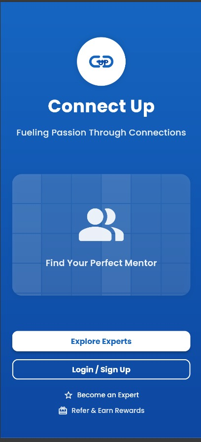
  
  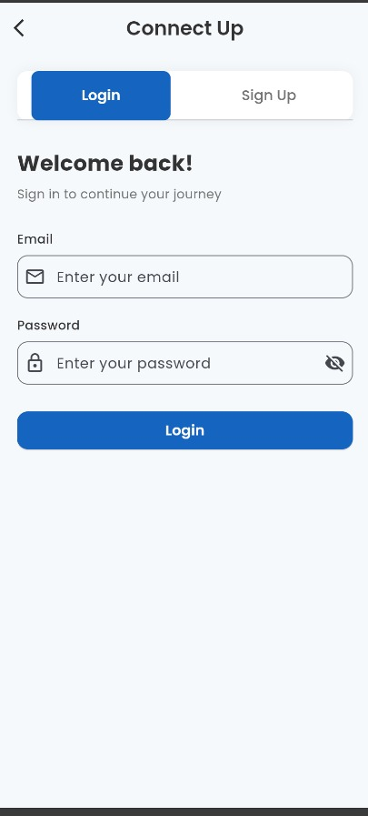
  
  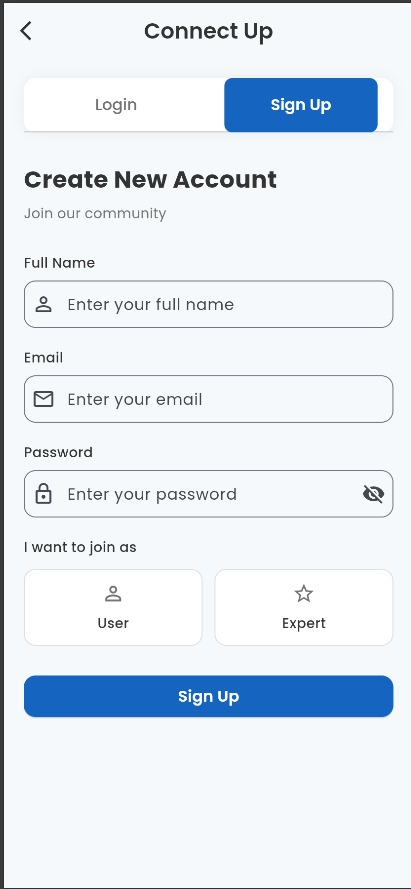
  
  <br><br>
  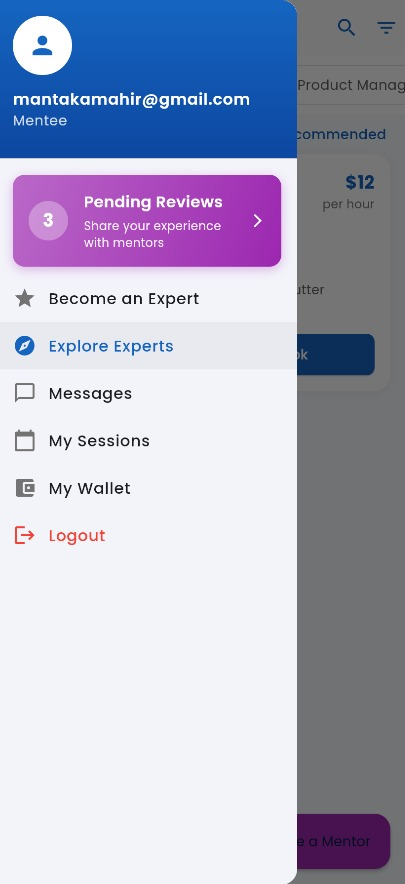
  
  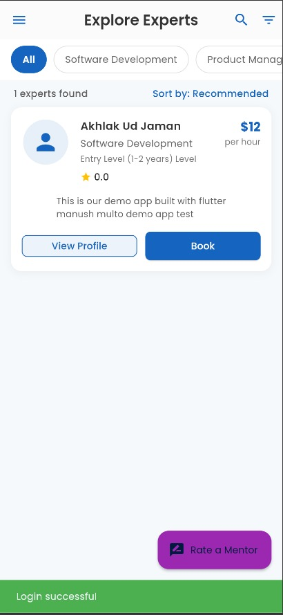
  
  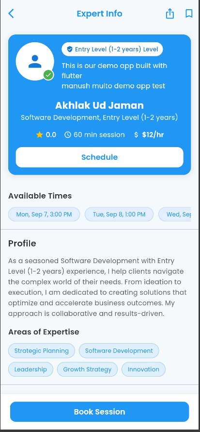
  
  <br><br>
  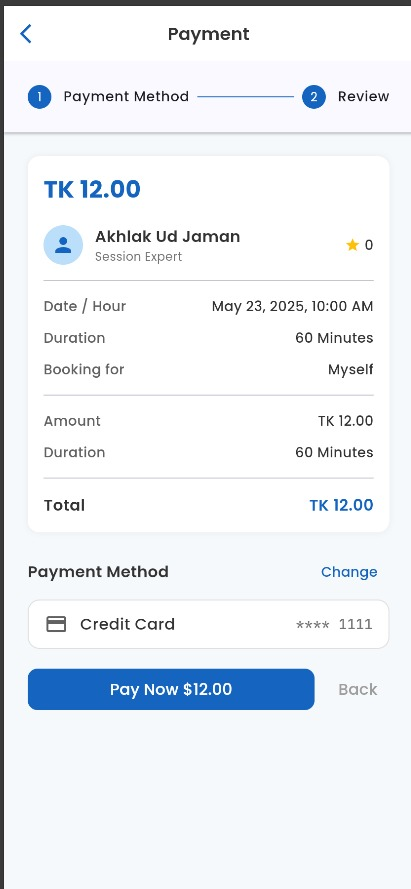
  
  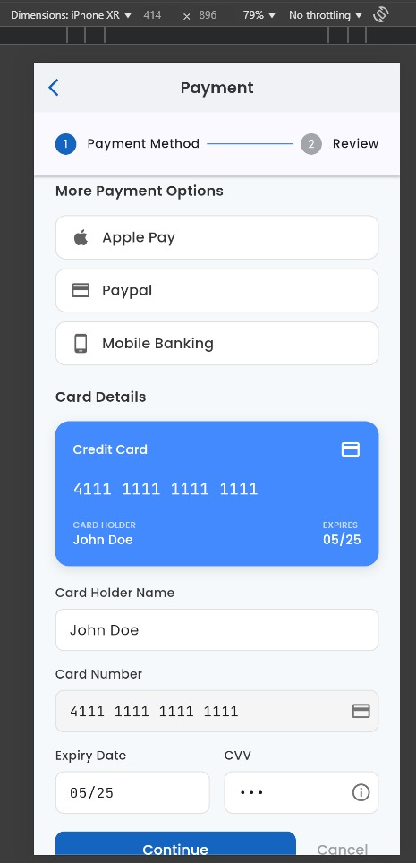
  
  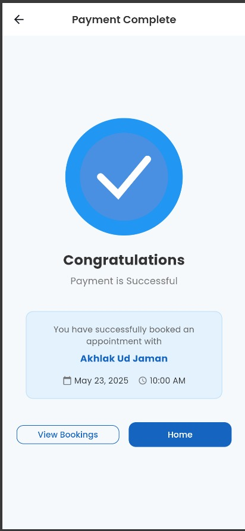
</div>

### 👨‍💼 Expert Flow
<div align="center">
  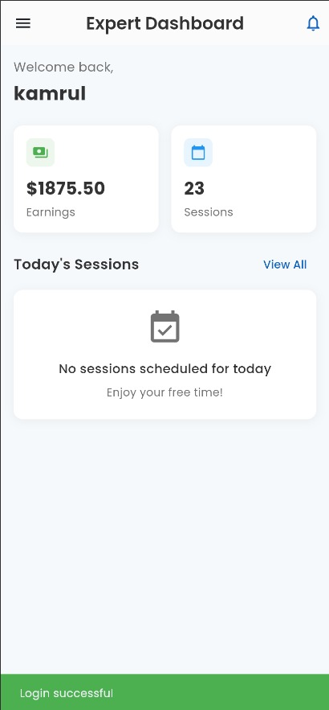
  
  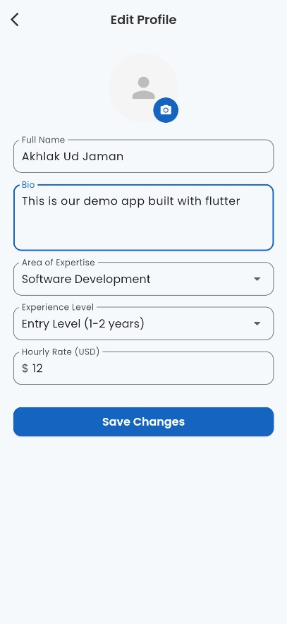
  
  <br><br>
  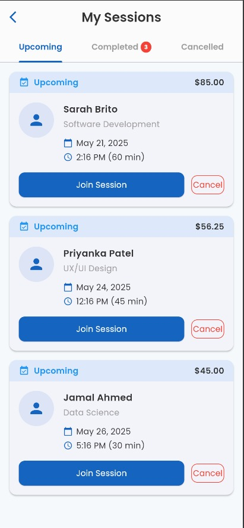
  
  
  
  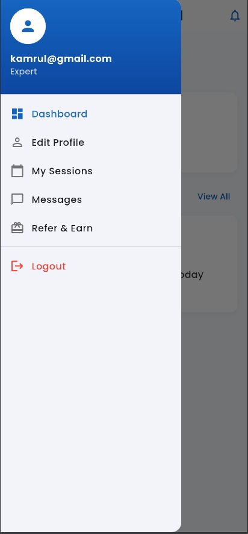
</div>

## ✨ Features

### 👥 For Users
- **Secure Authentication** - Email/Password and Google Sign-in options
- **Expert Discovery** - Browse and filter experts by expertise areas
- **Session Booking** - Schedule consultation sessions with preferred experts
- **Real-time Chat** - Integrated chat system for communication with experts
- **Session Management** - View upcoming and past consultation sessions
- **Profile Management** - Update personal information and preferences

### 👨‍💼 For Experts
- **Expert Profile Creation** - Showcase expertise, experience, and availability
- **Session Management** - Accept/decline session requests and manage bookings
- **Chat Integration** - Communicate with users before and after sessions
- **Availability Control** - Set available time slots for consultations
- **Dashboard** - Track sessions and client interactions

## 🛠️ Technology Stack

- **Frontend**: Flutter (Cross-platform framework)
- **Backend**: Firebase
  - Cloud Firestore (Database)
  - Firebase Authentication
  - Cloud Functions
  - Firebase Hosting
- **Real-time Features**: Firebase Realtime Database
- **State Management**: Provider

## 🚀 Live Demo

Experience ConnectUp live at: [https://bd-connectup.web.app](https://bd-connectup.web.app)<br>
[](https://drive.google.com/file/d/1zJPb_zkIrMISYxzGu0JsHjfD0Xu8wCWZ/view?usp=sharing)
<br>
you can sign up or use
user mail and pass:user@test.com<br>
expert main and pass:expert@test.com
## 🏗️ Architecture

The project follows a clean architecture pattern with:
- Separation of concerns between UI, business logic, and data layers
- Provider pattern for state management
- Repository pattern for data operations
- Service-based architecture for Firebase interactions

## 📱 App Structure
```
lib/
├── models/       # Data models
├── screens/      # UI screens
├── services/     # Firebase services
├── utils/        # Utility functions
└── widgets/      # Reusable UI components
```

## 🔧 Setting Up Locally

1. Clone the repository
```bash
git clone https://github.com/Mantaka-Mahir/connectup-firebase.git
```

2. Install dependencies
```bash
flutter pub get
```

3. Configure Firebase
   - Create a new Firebase project
   - Add your `google-services.json` for Android
   - Add `GoogleService-Info.plist` for iOS
   - Update Firebase configuration in `lib/firebase_options.dart`

4. Run the app
```bash
flutter run
```

## 📄 License

This project is licensed under the MIT License - see the [LICENSE](LICENSE) file for details.

## 🤝 Contributing

Contributions are welcome! Feel free to submit a Pull Request.
